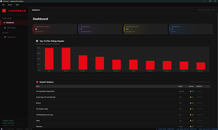
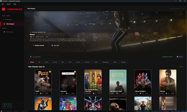
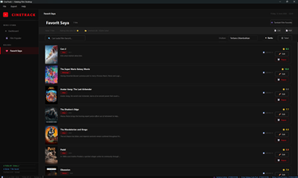
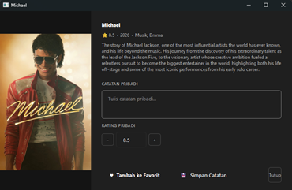
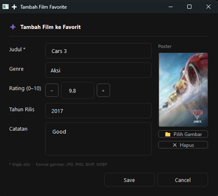
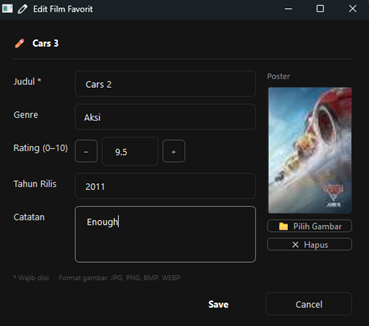
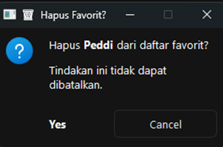
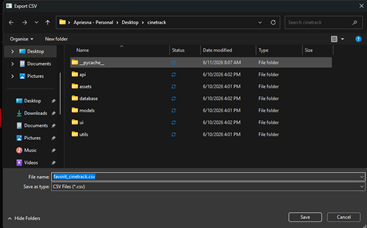

# 🎬 CineTrack — Katalog Film Desktop

Aplikasi desktop katalog film berbasis **PySide6**, data film dari **TMDb API v3**, penyimpanan lokal **SQLite**.

## Anggota Kelompok

| Nama | NIM | Modul |
|------|-----|-------|
| Apriesna Zulhan | F1D02310100 | `config.py`, `api/`, `database/`, `models/`, `utils/export.py`, `ui/main_window.py`, `ui/components/stat_card.py`, `ui/pages/dashboard_page.py` |
| Cindy Natasya Aulia Putri | F1D02310109 | `main.py`, `ui/theme.py`, `assets/style.qss`, `ui/pages/favorites_page.py` |
| Wahyu Indra Purnama | F1D02410099 | `ui/components/movie_card.py`, `ui/components/hero_banner.py`, `ui/components/image_cache.py`, `ui/pages/movies_page.py`, `README.md` |

## Fitur

- **3 Halaman**: Dashboard (chart), Film Populer (grid + hero), Favorit Saya (CRUD)
- **Navigasi**: Sidebar + `QStackedWidget` + Menu Bar (File / Export / Help)
- **Pencarian & Filter**: Search judul + filter genre (chips) di Film Populer; search + sort di Favorit
- **Export**: CSV dan PDF (via ReportLab, fallback HTML) dari halaman Favorit
- **Visualisasi**: Bar chart Top 10 popularitas (QtCharts)
- **Multithreading**: QThread workers untuk fetch API dan download gambar paralel
- **Database**: SQLite 2 tabel (`favorit` + `riwayat`) dengan relasi foreign key
- **Validasi**: Semua form divalidasi — field kosong, format, panjang karakter
- **Styling**: Netflix dark theme via `setStyleSheet()` global (QSS)
- **Status Bar**: Nama & NIM semua anggota (tidak dapat diedit)

## Screenshot

### Dashboard



### Film Populer



### Favorit Saya



### Detail Film



### Tambah Film



### Edit Film



### Hapus Film



### Export Film ke PDF/CSV



## Instalasi & Jalankan

```bash
pip install -r requirements.txt
python main.py
```

### Dependensi opsional (untuk export PDF):
```bash
pip install reportlab
```
Jika `reportlab` tidak terinstal, export PDF otomatis menggunakan fallback HTML.

## Struktur Folder

```
CineTrack/
├── main.py               # Entry point
├── config.py             # Konfigurasi (API key, URL)
├── requirements.txt
├── README.md
├── api/
│   ├── tmdb_client.py    # TMDb REST API client
│   └── workers.py        # QThread workers
├── database/
│   └── db_manager.py     # SQLite CRUD (tabel: favorit, riwayat)
├── utils/
│   └── export.py         # Export CSV & PDF
└── ui/
    ├── theme.py           # Netflix dark theme + QSS
    ├── main_window.py     # Jendela utama + sidebar + menu bar
    ├── pages/
    │   ├── dashboard_page.py   # Statistik + chart
    │   ├── movies_page.py      # Grid film + hero + detail
    │   └── favorites_page.py   # CRUD + search + sort + export
    └── components/
        ├── movie_card.py
        ├── hero_banner.py
        ├── image_cache.py
        └── stat_card.py
```
